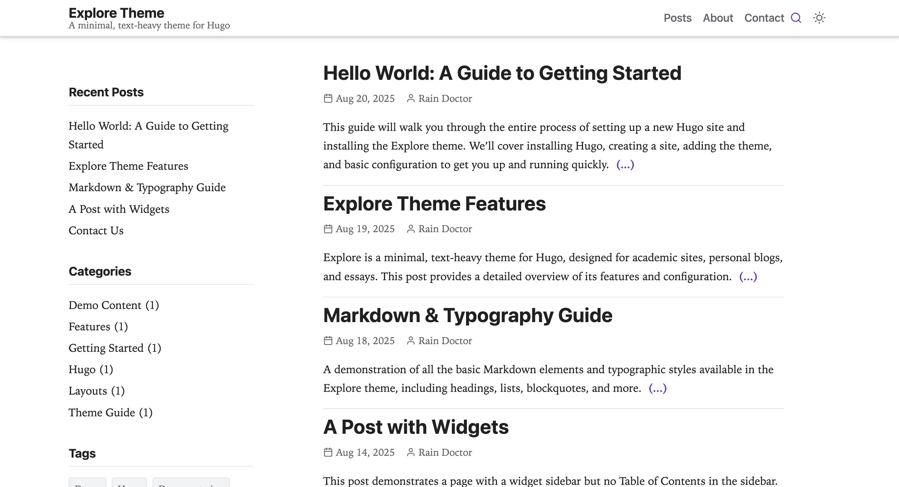
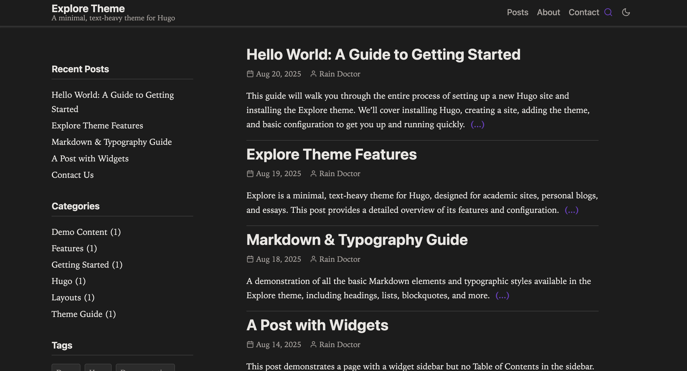

# Explore - A Hugo Theme

**Explore** is a minimal, text-heavy theme for [Hugo](https://gohugo.io/). It is designed for academic sites, personal blogs, and essays, and prioritizes readability, performance, accessibility, and maintainability.

[](https://yogirk.github.io/explore/)


<p align="center">
  
  
</p>

## Features

- Dark mode with auto-detection, manual toggle, and per-palette dark overrides
- Two self-hosted font presets (Inter, Google Sans) — no external requests
- Four color palettes (`default`, `ocean`, `forest`, `slate`) or custom primary/accent
- Three-tier design token architecture (primitive, semantic, component)
- Client-side search via Fuse.js (zero-config) or Pagefind (large sites)
- Reading progress bar, code copy, ScrollSpy ToC, breadcrumbs — all automatic
- WCAG 2.1 AA: semantic HTML, ARIA landmarks, keyboard navigation
- SEO: JSON-LD structured data, OpenGraph, Twitter Cards
- SRI hashes, IIFE scripts, Hugo Pipes asset pipeline
- Responsive figure shortcode with WebP and LQIP blur-up

## Quickstart

For a detailed walkthrough, see the [Getting Started Guide](exampleSite/content/posts/hello-world.md). Here's the short version:

1.  **Add the theme as a submodule:**
    From the root of your Hugo site, run:
    ```bash
    git submodule add https://github.com/yogirk/explore.git themes/explore
    ```

2.  **Use the example configuration:**
    Copy the example configuration file from the theme to your site's root directory. This is the fastest way to see all features in action.
    ```bash
    cp themes/explore/exampleSite/config.toml .
    ```
    The example `config.toml` already has `theme = "explore"` set.

3.  **Run the Hugo server:**
    ```bash
    hugo server
    ```
    Your site is now available at `http://localhost:1313/`.

## Configuration

All theme options are configured in your site's `config.toml` file under the `[params]` section.

```toml
# --- Site-level settings ---
baseURL = "https://example.org/"
languageCode = "en-us"
title = "My Site"
theme = "explore"
summaryLength = 70

[outputs]
  home = ["HTML", "RSS", "JSON"] # JSON required for Fuse.js search

[build]
  writeStats = true # Required for Hugo Pipes

[pagination]
  pagerSize = 5

# --- Theme Parameters ---
# Every parameter below has a built-in default. Override only what you need.

[params]
  author = "Your Name"
  description = "A description of your site."
  logo = ""                       # Path in /static, e.g. "images/logo.svg". Empty = text title.
  tagline = ""
  # dateFormat = "Jan 2, 2006"    # Go reference-time layout
  # mainSections = ["posts"]      # Content sections shown on homepage

  [params.ui]
    stickyHeader = true
    showSearch = true
    searchEngine = "fuse"         # "fuse" or "pagefind"
    homeView = "default"          # "default" or "compact"

  [params.style]
    fontPreset = "inter"          # "inter" or "google-sans"
    palette = "default"           # "default", "ocean", "forest", or "slate"
    # primary = "#1a73e8"         # Override primary color (only when palette = "default")
    # accent  = "#1e8e3e"         # Override accent color  (only when palette = "default")
    containerMaxWidth = "1280px"
    maxWidthCh = 75

  [params.sidebar]
    globalPosition = "right"      # "left", "right", "bottom", or "off"
    widgets = ["recent", "categories", "tags"]
    recentCount = 5

  [params.hero]
    show = false
    # title = ""
    # tagline = ""
    # buttonText = ""
    # buttonURL = ""

  [params.list]
    showExcerpt = true

  [params.single]
    showPrevNext = true
    showRelated = true
    relatedCount = 4
    [params.single.toc]
      enable = true
      position = "inline"         # "inline", "left", "right", or "off"
```

## Font & Color Customization

### Font Presets

| Preset | Sans-Serif | Monospace | Character |
|--------|-----------|-----------|-----------|
| `inter` (default) | Inter | JetBrains Mono | Clean, neutral, highly legible |
| `google-sans` | Google Sans Flex | Google Sans Code | Friendly, geometric, modern |

Set via `params.style.fontPreset` in your `config.toml`. Both presets are self-hosted — no external font requests are made.

### Color Palettes

| Palette | Light Primary | Light Accent | Character |
|---------|--------------|-------------|-----------|
| `default` | `#1a73e8` | `#1e8e3e` | Familiar blue/green — works everywhere |
| `ocean` | `#0077b6` | `#00838f` | Deep teal — calm, professional |
| `forest` | `#2d6a4f` | `#52b788` | Natural green — warm, organic |
| `slate` | `#475569` | `#64748b` | Understated gray — minimal, editorial |

Each palette defines independent dark-mode overrides to maintain contrast and readability. When `palette` is set to anything other than `default`, the `primary` and `accent` values in your config are ignored in favor of the palette's built-in values.

## Search Setup

The theme supports two client-side search engines, configured via `params.ui.searchEngine`.

### 1. Fuse.js (Default & Easiest)

Fuse.js is a lightweight fuzzy search library that works out of the box with zero extra build steps. It's ideal for small to medium-sized sites.

**Setup:**
1.  Set `searchEngine = "fuse"` in `config.toml`.
2.  Ensure `JSON` is in your homepage's `outputs` in `config.toml`.

### 2. Pagefind

Pagefind is a powerful static search solution suitable for larger sites. It requires an extra command-line step after building.

**Setup:**
1.  Set `searchEngine = "pagefind"` in `config.toml`.
2.  Install the Pagefind CLI: `npm install -g pagefind`.
3.  After building your site with `hugo`, run Pagefind to index the output:
    ```bash
    hugo
    npx pagefind --site public
    ```

## Shortcodes

### Figure

A shortcode for responsive, optimized images. It generates WebP format with LQIP (Low-Quality Image Placeholder) blur-up effect and `srcset` for responsive sizing.

```go-html-template

```

### Callout

A shortcode to create styled boxes to draw attention to important information.

```go-html-template

**Info:** This is an informational callout. It's useful for tips and notes.



**Warning:** This is a warning callout. Use it for important caveats.

```

## License

The Explore theme is licensed under the **MIT** license. See `LICENSE` for more details.
